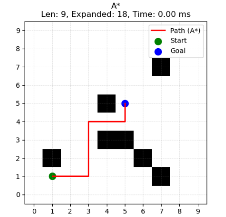
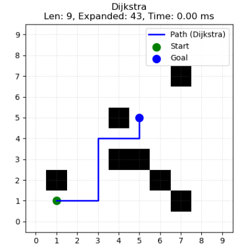
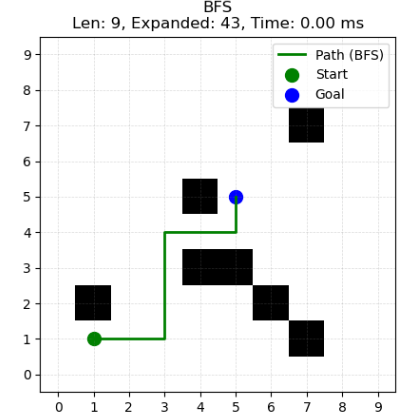
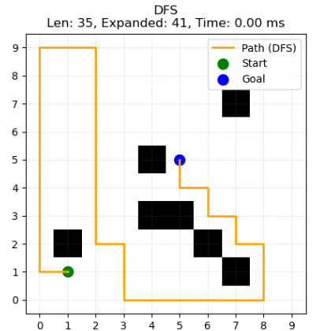

# Path Planning Algorithms Visualizer

This project demonstrates and compares classical path planning algorithms — **A\***, **Dijkstra**, **Breadth-First Search (BFS)**, and **Depth-First Search (DFS)** — on a 2D grid. It visualizes the path generated by each algorithm and compares them based on execution time and path length.

---

## Features

- User inputs:
  - Grid size (rows × columns)
  - Start and goal coordinates
  - Obstacle coordinates
- Algorithms implemented:
  - A* Search
  - Dijkstra’s Algorithm
  - Breadth-First Search (BFS)
  - Depth-First Search (DFS)
- Visual output:
  - Path from start to goal plotted for each algorithm
  - Time taken and path length shown
  - Comparison graphs for performance metrics

---
## A* Algorithm Visualization

## Dijkstra Algorithm Visualization

## BFS Algorithm Visualization

## DFS Algorithm Visualization

